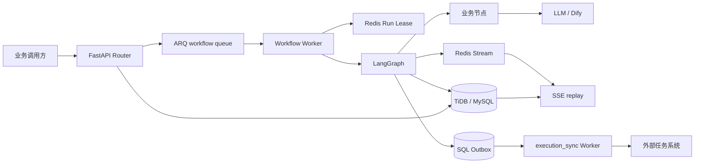

# Obei Workflow SDK 当前状态与整体设计

更新时间：2026-09-08  
SDK 版本：0.3.3

## 1. 项目目标

Obei Workflow SDK 面向需要快速落地持久工作流的业务团队。使用者主要负责：

1. 定义工作流输入和共享 State；
2. 编写每个业务节点的 `execute()`；
3. 在 `Workflow.build()` 中注册节点和依赖；
4. 配置数据库、Redis、模型及任务系统连接。

SDK 统一提供节点生命周期、异步执行、Checkpoint 恢复、Artifact、事件流、人工确认、
模型调用审计和外部任务系统同步。工作流执行图和远端注册 JSON 都来自同一个
`Workflow.build()`，避免维护两份流程定义。

当前正常执行路径已经完整可用，离线回归通过。最近一轮优化集中处理了租约失效、
同步节点阻塞、远端任务重试、Outbox 补偿、SSE 回放和 Dify 错误流识别。

## 2. 仓库和交付结构

```text
sdk/                                独立 Python SDK
templates/workflow-project-template 完整业务项目模板
examples/simple_workflow/            最小集成示例
starter/                             生产组件示例和扩展回归
docs/                                设计、功能和使用文档
scripts/                             构建、迁移及联调脚本
dist/workflow-project-template.zip   推荐交付物
```

推荐向使用者交付 `dist/workflow-project-template.zip`。模板内置当前 SDK 源码，不依赖
内部 PyPI；使用者解压、安装依赖后，只需要修改 `src/workflow_app/workflows`。

## 3. 总体架构



核心原则：

- 数据库保存可恢复事实，Redis 负责调度、租约和实时事件；
- API 返回 HTTP 202，实际工作流由 ARQ Worker 异步推进；
- 节点只处理业务，SDK 包装节点生命周期和基础设施能力；
- 外部任务系统调用通过 SQL Outbox 隔离，不阻塞工作流；
- Redis Stream 丢失不会破坏持久业务事件，数据库仍可回放；
- 业务外部副作用必须使用稳定 operation key 保证幂等。

## 4. 工作流和节点模型

每个 Workflow 声明：

- `workflow_type`：稳定的工作流标识；
- `input_model`：HTTP 输入模型；
- `state_model`：LangGraph 共享状态；
- `build(graph)`：节点、边和条件路由；
- `initial_state()`：Task/Run 到初始 State 的映射。

每个节点声明 `TaskStep`、输入模型、State 字段映射以及可选的 LLM/Dify 配置，只需
实现 `execute()`。I/O 节点推荐使用 `async def execute()`。为了兼容已有业务，同步
函数和同步 generator 会在线程中运行，不会阻塞 ARQ 的事件循环；CPU 密集计算仍应
使用进程池或独立计算服务。

Runtime 创建时会立即构建、导出并编译所有已注册工作流。重复节点、错误边、环、
无法静态解析的条件依赖等问题会在应用启动时暴露，而不是等到第一个用户任务。

## 5. 运行状态和恢复

主要状态流转：

```text
QUEUED → RUNNING → SUCCEEDED
                 → FAILED → QUEUED → RUNNING
                 → WAITING_USER → QUEUED → RUNNING
                 → CANCELLED
```

Task 表示用户看到的任务；Run 表示本地持久执行实例。当前失败重试沿用原 Run 和
LangGraph thread key，从最近 Checkpoint 继续。已经成功且写入 Checkpoint 的节点不会
再次运行，失败节点会产生新的 attempt。

Redis Run Lock 使用 owner token、TTL 和后台续租。同一 Run 同时只允许一个 Worker
推进。SDK 现在会在节点开始、模型调用前后和节点结果落库前检查租约；失去所有权的
旧 Worker 不再保存结果或向任务系统发送误导状态。

租约到期负责释放执行权，不负责主动创建新的 ARQ 消息。ARQ job timeout 和重试通常
负责重新投递；若未来出现大量任务因 Worker 强制退出而停留在 RUNNING，应增加独立的
运行心跳和超时任务巡检器。

## 6. 持久化数据设计

核心运行表：

| 表 | 作用 |
|---|---|
| `obei_workshop_task` | 用户任务、状态、输入、当前节点和最终产物 |
| `obei_workshop_task_run` | 本地 Run、状态序号和 LangGraph thread key |
| `obei_workshop_task_checkpoint` | LangGraph Checkpoint 和 pending writes |
| `obei_workshop_task_node_execution` | 节点版本、attempt、耗时和错误 |
| `obei_workshop_task_artifact` | 版本化业务产物、哈希和内容引用 |
| `obei_workshop_task_event` | 可回放的持久业务事件 |
| `obei_workshop_task_decision` | 人工确认决定及产物版本校验 |

集成与模型表：

| 表 | 作用 |
|---|---|
| `obei_workshop_execution_binding` | 本地任务与多个远端 taskId 的绑定历史 |
| `obei_workshop_task_system_outbox` | 严格排序、可重试的远端同步事件 |
| `obei_workshop_llm_invocation` | 直接模型请求、响应、usage 和错误审计 |
| `obei_workshop_dify_conversation` | Task 级 Dify conversation 映射 |
| `obei_workshop_dify_invocation` | Dify 调用、远端 ID、输出及错误审计 |

## 7. 外部任务系统设计

一个本地 Task/Run 可以对应多个远端任务：

```text
local task + local run
  ├─ binding retry_seq=0 → remote task A
  ├─ binding retry_seq=1 → remote task B
  └─ binding retry_seq=2 → remote task C
```

每次远端重试新增 Binding，保存 `parent_binding_id`、`retry_seq` 和
`external_task_id`，旧 Binding 保留审计。可通过以下接口查看完整历史：

```http
GET /api/v1/tasks/{task_id}/execution-bindings
```

新远端任务本身没有本地 Checkpoint 历史，因此重试过程为：

1. 新建 Binding 和远端任务；
2. 把远端任务置为 Running/Retrying；
3. 找出本地 Run 中仍为 SUCCEEDED 的节点；
4. 按旧 Binding 的事件顺序补发这些节点的 start/success；
5. 再同步本地恢复后产生的新节点事件。

任务状态 Outbox 的幂等键包含状态转换序号，因此
`RUNNING → WAITING_USER → RUNNING` 不会丢失第二次 RUNNING。execution-sync Worker
每 15 秒扫描到期的 PENDING Outbox，能够补偿事务提交后 Redis 唤醒丢失。存在永久
失败事件时派发结果返回 `PARTIAL_FAILURE` 并保留 `last_error`。

业务副作用幂等与远端 Binding 相互独立。业务 operation key 应基于稳定的本地
`run_id + node_code + 业务操作 ID`；循环节点加入稳定迭代 ID。不能加入
`ctx.attempt` 或远端 taskId，否则本地重试或切换 Binding 会重复执行副作用。

## 8. 事件和 SSE

低频重要事件先写数据库，再发布带 `db_event_seq` 的 Redis 副本。模型 token 等高频
事件默认只进入 Redis Stream。

SSE 建立连接时：

1. 记录当前 Redis Stream tail，开始缓存新实时事件；
2. 从 `Last-Event-ID` 后分页读取数据库，直到 backlog 全部输出；
3. 从第一步记录的 tail 开始消费 Redis 缓冲；
4. 根据 `db_event_seq` 去除数据库和 Redis 的重叠事件；
5. 继续阻塞读取实时事件并发送心跳。

目前不需要 Kafka。数据库和 Redis Stream 已能满足按 task_id 回放和实时订阅。若未来
需要跨服务消费者组、长期消息保留、独立事件平台或显著更高吞吐，再评估 Kafka。

## 9. 模型和 Dify 集成

直接模型通过 `LLMRegistry` 和 OpenAI-compatible Adapter 调用。节点使用
`LLMNodeConfig` 显式选择 Adapter、模型和是否流式；SDK 统一记录请求、响应、推理、
usage、provider request ID，并发布统一的 token 事件。

Dify 使用独立的 App Registry，支持 Chatbot、Agent、Chatflow、Text Generator 和
Workflow 等模式，可选择持久 conversation。Dify 流现在严格要求成功终止事件：

- Chat/Completion 必须收到 `message_end`；
- Workflow 必须收到成功的 `workflow_finished`；
- `error`、`workflow_failed`、失败状态或提前断流都会进入失败审计和 `llm_error`。

未来“先 run 创建、再 stream 消费”的模型协议已经预留 `RunStreamAdapter`。具体供应商
接入时实现 `run()` 和 `stream()` 即可注册到现有 LLM Registry。自动重试、状态查询、
取消和断线续流需要等供应商协议明确 idempotency key、run status 和 stream cursor 后
再实现，避免重复创建付费任务。

## 10. Runtime 组装和扩展

`create_runtime()` 默认组装 SQLAlchemy Storage、ARQ Dispatcher、Redis EventBus、
ExecutionTaskAdapter、LLM Registry 和 Dify Registry。调用方可替换：

- `storage`
- `dispatcher`
- `task_system`
- `event_bus`
- `llm_registry`
- `dify_registry`

显式传入 `event_bus=None` 可以关闭实时事件，数据库持久事件仍正常工作。测试可使用
SQLite、InlineDispatcher 和 NullTaskSystemAdapter，不需要真实 Redis、模型或任务系统。

## 11. 最近完成的优化

本轮完成：

- 增加节点边界租约校验，阻止失锁 Worker 继续落库；
- 同步节点和同步 generator 在线程执行，避免阻塞 ARQ loop；
- 新 Binding 自动补发 Checkpoint 已完成步骤；
- 增加 Binding 历史查询 API；
- 修正重复状态转换被错误去重；
- 增加 PENDING Outbox 定时扫描和 `PARTIAL_FAILURE` 结果；
- 修复超过 1000 条历史事件时 SSE 跳过序号的问题；
- 修复 Dify 错误事件、失败 Workflow 和提前断流被当作成功的问题；
- 开放 EventBus、LLM Registry 和 Dify Registry 注入；
- 增加启动阶段工作流图校验；
- 预留 run/stream 模型 Adapter；
- 修正业务副作用幂等文档及 Starter SDK 版本；
- 新增对应离线回归测试并重新生成交付 ZIP。

验证结果：完整源码测试 34 项通过，生成后的交付模板测试 18 项通过，Python 编译检查
通过。当前交付物为 `dist/workflow-project-template.zip`。

## 12. 当前边界和后续建议

当前暂不处理：

- 工作流 Task/Run 提交成功、ARQ 入队失败之间没有独立调度 Outbox；
- Worker 被强制终止后的 RUNNING 超时巡检和主动重新调度；
- Router 的企业认证、租户隔离和数据权限；
- 业务节点自身外部副作用的自动补偿；
- 高频瞬时 token 的数据库长期回放；
- run/stream 供应商的具体协议和断线续流。

建议观察 QUEUED/RUNNING 卡住率、ARQ retry、租约丢失、Outbox PENDING 时长及
`PARTIAL_FAILURE` 告警。如果前两类卡住任务开始成为实际问题，再增加工作流调度
Outbox、Worker heartbeat 和 reconciliation job。

## 13. 文档入口

- 新项目交付：[TEMPLATE_PROJECT.md](TEMPLATE_PROJECT.md)
- 能力清单：[SDK_FEATURES.md](SDK_FEATURES.md)
- 从零开发：[BUILD_FIRST_WORKFLOW.md](BUILD_FIRST_WORKFLOW.md)
- 完整 API 与生产参考：[SDK_USAGE.md](SDK_USAGE.md)
- TiDB 索引：[TIDB_REQUIRED_INDEXES.sql](TIDB_REQUIRED_INDEXES.sql)
